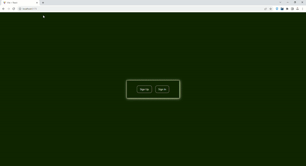

# Firebase Authentication App

This is a simple authentication app built using Firebase and React. Users can sign up, sign in, update their profile, reset their password, and log out. The app uses Firebase for authentication and Redux Toolkit for state management.

## Screen

## Table of Contents
- [Features](#features)
- [Technologies](#technologies)
- [Getting Started](#getting-started)
- [Usage](#usage)

## Features

- User registration with email and password
- User login with email and password
- Update user profile information (name, photo)
- Reset user password
- Email verification
- User logout
- Redux Toolkit for state management

## Technologies

- React
- Firebase Authentication
- Redux Toolkit
- React Router
- Tailwind CSS

## Usage
- Register a new user with your email and password.
- Sign in with your registered credentials.
- Update your profile information (name and photo).
- Reset your password if needed.
- Verify your email by clicking the "Confirm email" button.
- Log out when you're done.